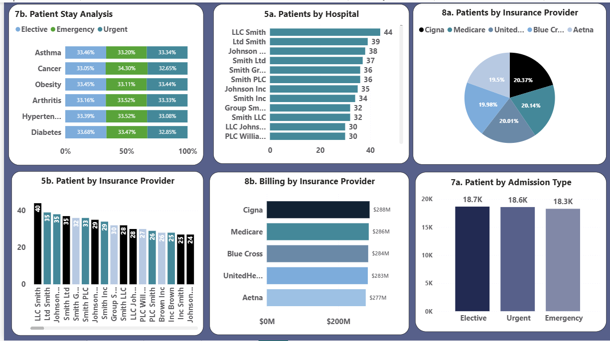

# Healthcare Analytics Dashboard

## Project Overview
This project analyzes patient demographics, medical conditions, hospital performance, insurance coverage, and billing trends using Power BI.

## Tools Used
 Power BI
- Microsoft Excel

## Dashboard Preview

## Business Questions Answered
- Which medical conditions are most common?
- How are patients distributed across age groups?
- Which insurance providers handle the most patients?
- What are the billing patterns across conditions?
- Which hospitals manage the highest patient volumes?

## Key Insights
- Arthritis and Diabetes accounted for a significant portion of patient records.
- Billing amounts varied across insurance providers.
- Certain hospitals handled substantially more patients.
- Admission patterns differed by age group and condition.

## Files Included
- Healthcare Dashboard.pbix
- Dashboard Screenshot

## Author

Dorothy Ekenga
